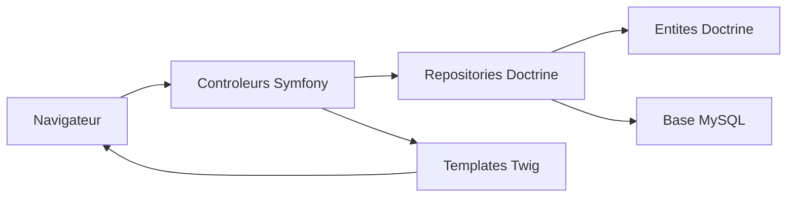

# Documentation technique - MediaTek Formation

## 1. Objet du document

Ce document décrit l'architecture technique de l'application MediaTek Formation, ses composants applicatifs, son modèle de données, ses routes, ses règles de sécurité et son dispositif de test.

Le périmètre couvre le code spécifique de l'application. Les éléments générés automatiquement ou fournis par des dépendances ne sont pas détaillés :

- `vendor/` : dépendances Composer.
- `var/` : cache, logs et fichiers temporaires Symfony.
- `public/index.php` : point d'entree standard Symfony.
- `bin/console`, `bin/phpunit`, `vendor/bin/*` : executables generes par Symfony ou Composer.
- `migrations/Version20240513134621.php` : migration Doctrine auto-generee.
- `assets/vendor/` : assets tiers installes par Symfony AssetMapper.
- fichiers IDE comme `nbproject/` et `.idea/`.

## 2. Presentation generale

MediaTek Formation est une application Symfony 6.4 permettant de consulter des videos d'auto-formation rattachees a des playlists et des categories.

L'application contient deux espaces principaux :

- Front office public : accueil, liste des formations, detail d'une formation, liste des playlists, detail d'une playlist, CGU.
- Back office admin : gestion des formations, playlists et categories.

La base de donnees est relationnelle et exploitee via Doctrine ORM.

## 3. Stack technique

| Couche | Technologie |
| --- | --- |
| Framework | Symfony 6.4 |
| Langage | PHP >= 8.1 |
| ORM | Doctrine ORM 3 |
| Base de donnees | MySQL/MariaDB via Doctrine DBAL |
| Templates | Twig |
| Formulaires | Symfony Form |
| Validation | Symfony Validator |
| Securite | Symfony Security, authentification par formulaire |
| Assets | Symfony AssetMapper, ImportMap, Stimulus/Turbo disponibles |
| Tests | PHPUnit 9.6, Symfony PHPUnit Bridge |

Les dependances principales sont declarees dans `composer.json`.

## 4. Organisation du projet

| Repertoire | Role |
| --- | --- |
| `src/Controller/` | Controleurs HTTP front office, back office et securite |
| `src/Entity/` | Entites Doctrine et regles de validation |
| `src/Repository/` | Requetes Doctrine personnalisees |
| `src/Form/` | Types de formulaires du back office |
| `templates/` | Vues Twig front, admin et securite |
| `config/` | Configuration Symfony, Doctrine, Twig, securite et routes |
| `assets/` | Point d'entree JavaScript et CSS applicatifs |
| `tests/` | Tests unitaires, integration, fonctionnels et notes navigateur |
| `public/` | Front controller et ressources publiques |
| `mediatekformation.sql` | Script SQL de peuplement/import initial |

## 5. Architecture applicative

L'application suit l'architecture classique Symfony MVC.



Les controleurs recoivent les requetes, appellent les repositories pour recuperer ou modifier les donnees, puis rendent les templates Twig.

## 6. Modele de donnees

### 6.1 Entite `Formation`

Fichier : `src/Entity/Formation.php`

Une formation represente une video YouTube publiee dans une playlist.

| Propriete | Type | Description |
| --- | --- | --- |
| `id` | `int` | Identifiant technique auto-incremente |
| `publishedAt` | `DateTimeInterface|null` | Date de publication |
| `title` | `string|null` | Titre de la formation |
| `description` | `text|null` | Description detaillee |
| `videoId` | `string|null` | Identifiant YouTube |
| `playlist` | `Playlist|null` | Playlist de rattachement |
| `categories` | `Collection<Categorie>` | Categories associees |

Methodes metier utiles :

- `getPublishedAtString()` retourne la date au format `d/m/Y` ou une chaine vide.
- `getMiniature()` construit l'URL YouTube `default.jpg`.
- `getPicture()` construit l'URL YouTube `hqdefault.jpg`.

Contraintes de validation :

- date de publication obligatoire ;
- titre obligatoire, maximum 100 caracteres ;
- identifiant YouTube obligatoire, maximum 20 caracteres ;
- playlist obligatoire.

### 6.2 Entite `Playlist`

Fichier : `src/Entity/Playlist.php`

Une playlist regroupe plusieurs formations.

| Propriete | Type | Description |
| --- | --- | --- |
| `id` | `int` | Identifiant technique auto-incremente |
| `name` | `string|null` | Nom de la playlist |
| `description` | `text|null` | Description |
| `formations` | `Collection<Formation>` | Formations rattachees |

Methodes metier utiles :

- `getCategoriesPlaylist()` retourne les noms distincts des categories des formations de la playlist.
- `getNombreFormations()` retourne le nombre de formations rattachees.

Contraintes de validation :

- nom obligatoire ;
- nom limite a 100 caracteres.

### 6.3 Entite `Categorie`

Fichier : `src/Entity/Categorie.php`

Une categorie qualifie une ou plusieurs formations.

| Propriete | Type | Description |
| --- | --- | --- |
| `id` | `int` | Identifiant technique auto-incremente |
| `name` | `string|null` | Nom de la categorie |
| `formations` | `Collection<Formation>` | Formations associees |

Contraintes de validation :

- nom obligatoire ;
- nom limite a 50 caracteres.

### 6.4 Relations

| Relation | Cardinalite | Implementation Doctrine |
| --- | --- | --- |
| Playlist -> Formation | 1,n | `Playlist::$formations`, `Formation::$playlist` |
| Formation -> Categorie | n,n | `Formation::$categories`, `Categorie::$formations` |

La table de jointure Doctrine est `formation_categorie`.

## 7. Routes et controleurs

### 7.1 Front office

| Route | Nom | Controleur | Role |
| --- | --- | --- | --- |
| `/` | `accueil` | `AccueilController::index` | Affiche l'accueil et les 2 dernieres formations |
| `/cgu` | `cgu` | `AccueilController::cgu` | Affiche les CGU |
| `/formations` | `formations` | `FormationsController::index` | Liste toutes les formations et categories |
| `/formations/tri/{champ}/{ordre}/{table}` | `formations.sort` | `FormationsController::sort` | Trie les formations |
| `/formations/recherche/{champ}/{table}` | `formations.findallcontain` | `FormationsController::findAllContain` | Filtre les formations |
| `/formations/formation/{id}` | `formations.showone` | `FormationsController::showOne` | Affiche le detail d'une formation |
| `/playlists` | `playlists` | `PlaylistsController::index` | Liste les playlists |
| `/playlists/tri/{champ}/{ordre}` | `playlists.sort` | `PlaylistsController::sort` | Trie les playlists |
| `/playlists/recherche/{champ}/{table}` | `playlists.findallcontain` | `PlaylistsController::findAllContain` | Filtre les playlists |
| `/playlists/playlist/{id}` | `playlists.showone` | `PlaylistsController::showOne` | Affiche le detail d'une playlist |

Les pages de detail retournent une erreur 404 Symfony si l'identifiant demande ne correspond a aucune entite.

### 7.2 Back office

| Route | Nom | Controleur | Role |
| --- | --- | --- | --- |
| `/admin/formations` | `admin.formations.index` | `AdminFormationController::index` | Liste les formations par date decroissante |
| `/admin/formations/ajout` | `admin.formations.new` | `AdminFormationController::new` | Cree une formation |
| `/admin/formations/{id}/modifier` | `admin.formations.edit` | `AdminFormationController::edit` | Modifie une formation |
| `/admin/formations/{id}/supprimer` | `admin.formations.delete` | `AdminFormationController::delete` | Supprime une formation par POST avec jeton CSRF |
| `/admin/playlists` | `admin.playlists.index` | `AdminPlaylistController::index` | Liste les playlists |
| `/admin/playlists/ajout` | `admin.playlists.new` | `AdminPlaylistController::new` | Cree une playlist |
| `/admin/playlists/{id}/modifier` | `admin.playlists.edit` | `AdminPlaylistController::edit` | Modifie une playlist |
| `/admin/playlists/{id}/supprimer` | `admin.playlists.delete` | `AdminPlaylistController::delete` | Supprime une playlist |
| `/admin/categories` | `admin.categories.index` | `AdminCategorieController::index` | Liste et cree les categories |
| `/admin/categories/{id}/supprimer` | `admin.categories.delete` | `AdminCategorieController::delete` | Supprime une categorie |

Lors de la suppression d'une playlist ou d'une categorie, les associations existantes sont detachees avant suppression.

### 7.3 Securite

| Route | Nom | Controleur | Role |
| --- | --- | --- | --- |
| `/login` | `app_login` | `SecurityController::login` | Affiche le formulaire de connexion |
| `/logout` | `app_logout` | `SecurityController::logout` | Route interceptee par Symfony Security |

## 8. Repositories

### 8.1 `FormationRepository`

Fichier : `src/Repository/FormationRepository.php`

Responsabilites :

- persister et supprimer une formation ;
- trier les formations par champ direct ou relation ;
- filtrer les formations par valeur contenue ;
- recuperer les formations les plus recentes ;
- recuperer les formations d'une playlist.

Methodes principales :

| Methode | Description |
| --- | --- |
| `add(Formation $entity)` | `persist` puis `flush` |
| `remove(Formation $entity)` | `remove` puis `flush` |
| `findAllOrderBy($champ, $ordre, $table)` | Tri controle par liste blanche |
| `findByContainValue($champ, $valeur, $table)` | Filtre par champ direct ou relation |
| `findAllLasted($nb)` | Retourne les formations les plus recentes |
| `findAllForOnePlaylist($idPlaylist)` | Retourne les formations d'une playlist |

Le repository protege les tris et filtres dynamiques avec des listes blanches de champs autorises.

### 8.2 `PlaylistRepository`

Fichier : `src/Repository/PlaylistRepository.php`

Responsabilites :

- persister et supprimer une playlist ;
- trier les playlists par nom ;
- trier les playlists par nombre de formations ;
- filtrer les playlists par nom ou categorie.

Methodes principales :

| Methode | Description |
| --- | --- |
| `findAllOrderByName($ordre)` | Trie les playlists par nom |
| `findAllOrderByFormationCount($ordre)` | Trie les playlists par nombre de formations |
| `findByContainValue($champ, $valeur, $table)` | Filtre les playlists |

### 8.3 `CategorieRepository`

Fichier : `src/Repository/CategorieRepository.php`

Responsabilites :

- persister et supprimer une categorie ;
- recuperer les categories associees aux formations d'une playlist.

Methode specifique :

- `findAllForOnePlaylist($idPlaylist)`.

## 9. Formulaires

### 9.1 `FormationType`

Fichier : `src/Form/FormationType.php`

Champs :

- `title` : texte ;
- `publishedAt` : date HTML5 en champ unique ;
- `videoId` : texte ;
- `description` : zone de texte optionnelle ;
- `playlist` : liste Doctrine des playlists ;
- `categories` : selection multiple Doctrine des categories.

Le champ `categories` utilise `by_reference => false` pour appeler les methodes d'ajout/suppression de l'entite.

### 9.2 `PlaylistType`

Fichier : `src/Form/PlaylistType.php`

Champs :

- `name` : texte ;
- `description` : zone de texte optionnelle.

### 9.3 `CategorieType`

Fichier : `src/Form/CategorieType.php`

Champ :

- `name` : texte.

## 10. Templates Twig

Les templates sont regroupes par zone fonctionnelle.

| Repertoire | Role |
| --- | --- |
| `templates/pages/` | Pages publiques |
| `templates/admin/` | Back office |
| `templates/security/` | Connexion |
| `templates/basefront.html.twig` | Layout front office |
| `templates/admin/base.html.twig` | Layout back office |
| `templates/base.html.twig` | Layout Symfony general |

Les pages publiques affichent les donnees transmises par les controleurs et fournissent les liens de tri, filtrage et detail.

## 11. Securite

Configuration principale : `config/packages/security.yaml`.

L'application utilise un provider en memoire :

- utilisateur : `emeline` ;
- role : `ROLE_ADMIN` ;
- mot de passe : hash stocke en configuration.

Regles d'acces :

- `/login` est public ;
- toutes les routes commencant par `/admin` necessitent `ROLE_ADMIN` ;
- les routes front office sont publiques.

Le formulaire de connexion redirige vers `admin.formations.index` apres authentification reussie.

## 12. Configuration Doctrine

Configuration : `config/packages/doctrine.yaml`.

Doctrine lit la connexion via `DATABASE_URL`. Les entites sont mappees par attributs PHP dans `src/Entity`.

En environnement de test, Doctrine ajoute un suffixe au nom de base :

```yaml
dbname_suffix: '_test%env(default::TEST_TOKEN)%'
```

Cette configuration permet d'isoler la base de test de la base applicative.

Les etapes d'installation, de configuration MySQL, de migration, d'import SQL et de demarrage local sont detaillees dans [Installation et demarrage du projet](installation-demarrage.md).

## 13. Assets front

Point d'entree : `assets/app.js`.

Le projet utilise AssetMapper et ImportMap. Le CSS applicatif est importe depuis :

- `assets/styles/app.css`.

Stimulus et Turbo sont presents dans l'importmap, mais le code applicatif actuel n'utilise pas encore de controleur JavaScript metier.

## 14. Tests

Les tests sont organises en plusieurs niveaux.

| Repertoire | Role |
| --- | --- |
| `tests/Unit/` | Tests unitaires isoles |
| `tests/Integration/Validation/` | Validation des entites |
| `tests/Integration/Repository/` | Requetes repositories avec base de test |
| `tests/Functional/` | Parcours HTTP avec `WebTestCase` |
| `tests/Support/` | Fixtures et rafraichissement de base |
| `tests/Browser/` | Documentation/preparation des tests navigateurs |

Commandes utiles :

```bash
vendor/bin/phpunit
vendor/bin/phpunit --filter NomDuTest
```

Dans l'environnement local actuel, `vendor/bin/phpunit` est a privilegier par rapport a `vendor/bin/simple-phpunit`, car PHPUnit est deja installe dans les dependances du projet.

## 15. Flux fonctionnels principaux

### 15.1 Consultation des formations

1. L'utilisateur ouvre `/formations`.
2. `FormationsController::index` charge les formations et categories.
3. Le template `templates/pages/formations.html.twig` affiche le tableau.
4. Les actions de tri appellent `/formations/tri/...`.
5. Les actions de recherche appellent `/formations/recherche/...`.
6. Le detail d'une formation est accessible via `/formations/formation/{id}`.

### 15.2 Consultation des playlists

1. L'utilisateur ouvre `/playlists`.
2. `PlaylistsController::index` charge les playlists triees par nom.
3. Le template `templates/pages/playlists.html.twig` affiche le tableau.
4. Les tris et filtres appellent les routes dediees.
5. Le detail d'une playlist charge la playlist, ses categories et ses formations.

### 15.3 Gestion d'une formation

1. L'administrateur se connecte via `/login`.
2. Il accede a `/admin/formations`.
3. Il peut creer, modifier ou supprimer une formation.
4. Les formulaires utilisent `FormationType`.
5. La persistence est effectuee par `FormationRepository`.

## 16. Points de maintenance

- Les champs de tri et de recherche dynamiques doivent rester controles par liste blanche dans les repositories.
- Toute nouvelle route admin doit rester sous `/admin` ou recevoir une regle d'acces explicite.
- Toute nouvelle relation Doctrine doit etre couverte par une migration.
- Les suppressions doivent tenir compte des associations Doctrine avant suppression effective.
- Les tests repositories et fonctionnels doivent etre mis a jour a chaque evolution des filtres, tris ou routes principales.
- Pour les tests de compatibilite navigateur Chrome/Firefox, une suite Playwright peut completer les tests PHPUnit existants.

## 17. Commandes d'exploitation courantes

Installation et demarrage du projet :

Voir [Installation et demarrage du projet](installation-demarrage.md).

Execution des tests :

```bash
vendor/bin/phpunit
```

Vidage du cache :

```bash
php bin/console cache:clear
```

Creation d'une migration apres modification du modele :

```bash
php bin/console make:migration
```
